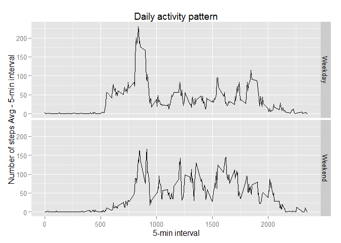

# Reproducible Research: Peer Assessment 1

*Load libraries*


```r
library(data.table)
library(plyr)
library(ggplot2)
```

## Loading and preprocessing the data

*1.Load data*


```r
df <- read.csv("activity.csv")
```
*2.Transform the data into data table*


```r
df.DT = data.table(df)
```

## What is mean total number of steps taken per day?

*1.Calculate the total number of steps taken per day - ignore missing values*

```r
require(plyr)
df_clean <- na.omit(df)
dfSteps<-ddply(df_clean,.(date) ,summarise, steps = sum(steps) )
```

*2.Make a histogram of the total number of steps taken each day*

```r
hist(dfSteps$steps , breaks = 20, main="Total Steps Per Day", xlab="Total steps" ,ylab="Frequency", col="blue")
```

 

*3.Calculate and report the mean and median of the total number of steps taken per day*

Mean


```r
MissingStepsMean <- mean(dfSteps$steps)
MissingStepsMean
```

```
## [1] 10766.19
```

Median


```r
MissingStepsMedian <- median(dfSteps$steps)
MissingStepsMedian
```

```
## [1] 10765
```

## What is the average daily activity pattern?

*1.Make a time series plot (i.e. type = "l") of the 5-minute interval (x-axis) and the average number of steps taken, averaged across all days (y-axis)*


```r
steps_interval <- aggregate(steps ~ interval , df_clean , mean)
plot (steps_interval , type = "l" , xlab = "Interval" , ylab = "Steps Avg" , col = "blue")
```

 

*2.Which 5-minute interval, on average across all the days in the dataset, contains the maximum number of steps?*


```r
max_steps_rowid <- which.max(steps_interval$steps)
steps_interval[max_steps_rowid,]
```

```
##     interval    steps
## 104      835 206.1698
```

## Imputing missing values

*1.Calculate and report the total number of missing values in the dataset*


```r
df_NA <- subset(df , is.na(df$steps))
nrow(df_NA)
```

```
## [1] 2304
```

*2.Devise a strategy for filling in all of the missing values in the dataset.*

  Strategy: Replace each missing value with the mean value of corresponding 5 minutes interval


*3.Create a new dataset that is equal to the original dataset but with the missing data filled in.*

```r
for (i in 1:nrow(df)){
  if (is.na(df$steps[i])){
    intervalVal <- df$interval[i]
    rowId <- which(steps_interval$interval == intervalVal)
    stepsVal <- steps_interval$steps[rowId]
    df$steps[i] <- stepsVal
  }
}
```

*4.Make a histogram of the total number of steps taken each day and Calculate and report the mean and median total number of steps taken per day. Do these values differ from the estimates from the first part of the assignment? What is the impact of imputing missing data on the estimates of the total daily number of steps?*


```r
dfStepsFilled<-ddply(df,.(date) ,summarise, steps = sum(steps) )
hist(dfStepsFilled$steps , breaks=30,main="Total Steps Per Day", xlab="Total steps" ,ylab="Frequency", col="blue")
```

 
*Mean of total number os steps*

```r
FilledstepsMean <- mean(dfStepsFilled$steps)
FilledstepsMean
```

```
## [1] 10766.19
```

*Median of total number os steps*

```r
FilledstepsMedian <- median(dfStepsFilled$steps)
FilledstepsMedian
```

```
## [1] 10766.19
```

The new values are a little bit higher because missing values are considered as zero , but it was replaced with values higher than 0 , then the total mean and median are higher.

## Are there differences in activity patterns between weekdays and weekends?


*1.Create a new factor variable in the dataset with two levels - "weekday" and "weekend" indicating whether a given date is a weekday or weekend day.*


```r
week <- factor(weekdays(as.Date(df$date)) %in% c("Saturday","Sunday"), 
               labels=c("Weekday","Weekend"), ordered=FALSE)

dfWeekDayEnd <- aggregate(df$steps, by=list(interval=df$interval, weekday=week), mean)
```

*2.Make a panel plot containing a time series plot (i.e. type = "l") of the 5-minute interval (x-axis) and the average number of steps taken, averaged across all weekday days or weekend days (y-axis).*


```r
g <- ggplot(dfWeekDayEnd, aes(interval, x) )

g + geom_line() + facet_grid(weekday ~ .) + 
     labs(y="Number of steps Avg - 5-min interval") +
     labs(x="5-min interval") +
     labs(title="Daily activity pattern")
```

 
